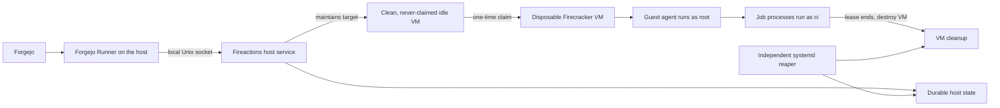

[](https://goreportcard.com/report/github.com/ALameLlama/fireactions)


Fireactions runs Forgejo Actions jobs in disposable Firecracker virtual machines (VMs). Firecracker uses Linux KVM to run each VM. Fireactions manages configured guest images, clean idle capacity, and job lifetimes through a local Unix socket.



Fireactions supports Forgejo Runner protocol version 13.2 on Linux. The Forgejo Runner and its registration credentials stay on the host. Each job runs in a Linux guest from a configured profile. A guest is destroyed after its lease ends. Fireactions does not resume jobs after a host service restart.

This fork uses the Go module `github.com/ALameLlama/fireactions`. It retains the Fireactions product name, binary names, and host state paths.

## Features

- Configured profiles select the guest image, kernel, CPU count, and memory size.
- A pool can keep clean, never-claimed guest VMs ready for jobs. A claimed VM is never reused.
- A hard lease limits job runtime. An independent systemd timer reaps expired resources after a service crash.
- The guest agent runs as root in a systemd unit with delegated cgroup v2 control. Job processes run as the `ci` user.

Fireactions does not provide SSH login, a default guest password, stdin or PTY access, signal forwarding, service containers, or Docker-container actions. It does not add a Firecracker jailer or claim that host execution is isolated from an administrator. Treat workflow code as untrusted and protect the host.

## Installation

On NixOS, import `github:ALameLlama/fireactions` through `nixosModules.default`. The module manages containerd/devmapper, CNI, the daemon, the independent reaper, and an optional Forgejo Runner. It requires an existing LVM thin pool and a prepared guest image. It never provisions or formats storage.

See [Install on NixOS](docs/user-guide/installation.md#install-on-nixos) and the [host flake example](examples/nixos/flake.nix). Keep your existing machine configuration and hardware imports. Register Runner separately and keep its token outside the Nix store. The host uses NixOS while the supplied guest uses Ubuntu 24.04.

On other Linux hosts, build or obtain the fork-built `fireactions` binary and prepare the host configuration. The default shell installer validates existing host prerequisites and does not replace containerd, LVM, or CNI configuration.

```bash
sudo ./install.sh --binary ./fireactions --config examples/fireactions.yaml
```

Use the [installation guide](docs/user-guide/installation.md) for host requirements, guest image import, Forgejo Runner registration, and service setup. Host dependency setup is a separate opt-in operation. Storage formatting is destructive and is not part of the default installation.

See the [user guide](docs/user-guide/overview.md) for configuration and operation details.

## CLI

```text
fireactions server --config /etc/fireactions/config.yaml
fireactions validate /etc/fireactions/config.yaml
sudo fireactions validate --host /etc/fireactions/config.yaml
fireactions pools list
fireactions ps
fireactions image list
fireactions reap --config /etc/fireactions/config.yaml
```

The plugin endpoint is a Unix socket, normally `unix:///run/fireactions/plugin.sock`. See the [CLI reference](docs/reference/cli.md) and [configuration reference](docs/reference/configuration.md) for all commands and fields.

## Contributing

See [CONTRIBUTING.md](CONTRIBUTING.md) for contribution instructions. GitHub hosts this source repository and its CI and release files. Fireactions uses Forgejo as its runner backend.

## License

See [LICENSE](LICENSE).
