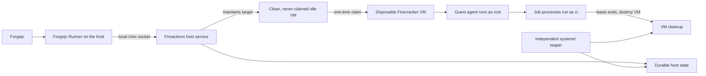

Fireactions runs Forgejo Actions jobs in disposable Firecracker virtual machines. It uses Linux KVM, a configured guest image and kernel, and a local Unix socket between the host service and Forgejo Runner.

A pool profile defines a bootable guest image, kernel, CPU count, and memory size. A pool can keep clean idle VMs ready. Once Forgejo Runner claims a VM, Fireactions destroys it after the job lease. It does not reuse the VM or resume the job after a host service restart.

Fireactions supports Forgejo Runner protocol version 13.2 on Linux. The Runner and its registration credentials stay on the host. Fireactions does not provide SSH login, guest passwords, stdin or PTY access, signal forwarding, service containers, Docker-container actions, or Firecracker jailer isolation.

For host requirements and the safe default installer, start with the [installation guide](user-guide/installation.md). Then see [core concepts](user-guide/concepts.md), [images](user-guide/images.md), and the [configuration reference](reference/configuration.md).

GitHub hosts the Fireactions source repository, CI, and release files. The runner execution backend is Forgejo.
